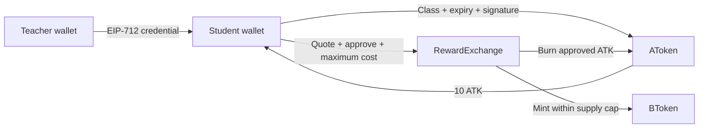

# Campus Token

**A campus attendance and rewards DApp prototype — React, Solidity, ethers.js and MetaMask.**

[Explore the demo](https://swenwang.github.io/campus/) · [Run & deploy](docs/DEPLOYMENT.md) · [Security & limitations](SECURITY.md)

Campus Token explores a simple question: how can verified classroom participation become a transparent reward? A teacher issues a wallet-bound attendance credential, a student claims participation tokens, and a smart contract converts them into a separate reward token.

## Try it in one minute

Open the demo and choose **Try without a wallet**. Issue a sample credential, claim 10 sample ATK, then convert them into 0.1 sample BTK. This walkthrough runs locally in the browser and is clearly labelled as simulated: no wallet, signature or blockchain transaction is involved.

The separate **wallet workspace** can inspect the configured Sepolia deployment through MetaMask. The bundled addresses belong to the legacy prototype. Version 2 attendance and exchange require a new deployment; legacy transaction actions are intentionally disabled. The walkthrough works without that deployment.

## My contribution

This originated as a team course project. My primary responsibility was the **frontend DApp implementation**: wallet connection, role-based teacher/student workspace, token balance display, attendance claim flow, approval and exchange interactions through ethers.js. Other team members contributed smart-contract and backend-related work.

The repository also includes a subsequent security-hardening iteration: wallet lifecycle handling, recipient-bound credentials, bounded exchange quotes, regression tests and reproducible build/deployment checks. This is a portfolio prototype, not a production launch or an independent security audit.

## What is implemented

| Area | Implementation |
|---|---|
| Wallet UX | MetaMask discovery, Sepolia switching, account/network invalidation, useful cancellation/pending errors |
| Attendance | EIP-712 credential bound to student, class, expiry, chain and contract; one claim per wallet/class |
| Participation token | ERC-20 AToken; 10 ATK per accepted attendance claim |
| Reward token | ERC-20 BToken with a 100 BTK supply cap |
| Exchange | Supply-tier pricing, explicit quotes, maximum-cost protection, limited approval and revocation |
| Presentation | Responsive landing page and a wallet-free interactive walkthrough |
| Validation | Frontend unit tests, contract regression tests, type/lint checks, build and security gates |

## Architecture



The frontend calls the contracts through the user's wallet provider. No backend receives the wallet's private key. The AToken owner acts as the teacher; RewardExchange owns BToken's mint permission.

## Design decisions

- **Separate participation from rewards.** ATK records earned participation value; BTK represents a future redemption layer. Campus merchant integration is not implemented.
- **Bind credentials to their context.** A signature for one wallet, chain or contract must not work for another. The teacher interface uses a 15-minute expiry.
- **Make exchange costs explicit.** The price doubles at each 5 BTK supply boundary. An initial 6 BTK order costs `5 × 100 + 1 × 200 = 700 ATK`; splitting an order must not bypass tier pricing.
- **Fail closed on wallet changes.** A changed account or chain clears the active workspace. A cancelled wallet request is not reported as a successful connection.
- **Keep the demo accessible.** Reviewers can explore the flow without installing a wallet; simulated and on-chain experiences are kept clearly labelled.

## Run locally

Node.js 22.13+ in the Node 22 series is required.

```sh
npm ci
npm run compile
npm run typecheck
npm test
cd frontend
npm ci
npm test
npm run lint
npm run build
npm run dev
```

The Vite app uses the `/campus/` base path. Tests and the walkthrough need no real wallet, private key or funded account. See [deployment instructions](docs/DEPLOYMENT.md) for optional Sepolia setup.

## Test coverage

Contract cases cover valid/repeated/expired attendance, wrong recipients and domains, owner permissions, tier-crossing orders, stale quotes, allowance failures, supply limits and rollback after failed minting. Frontend tests cover provider errors/events, transaction account guards, exact decimal parsing, signature context and walkthrough progression.

See the [GitHub Actions checks](https://github.com/swenwang/campus/actions) for the latest executable result. A successful test run does not establish real-world student identity, prove physical attendance or replace a security audit.

## Scope and next steps

This is a single-teacher, public-chain prototype. School identity verification, merchant redemption, individual credential revocation and migration from legacy tokens are not implemented. Use opaque class codes, never student names or numbers: chain data is public and permanent. Read [SECURITY.md](SECURITY.md) before deploying or adapting the project.
